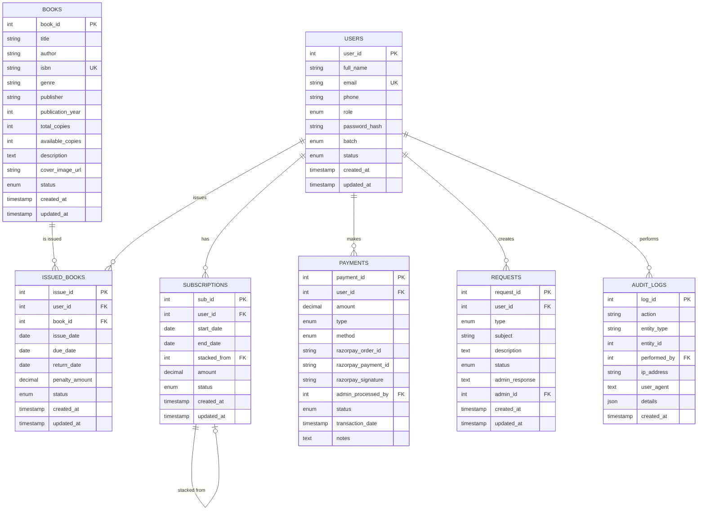

# Library Management System - Database Schema

## Entity Relationship Diagram

## Table Descriptions

### USERS
Stores user account information with role-based access control.
- **Roles**: ADMIN, MEMBER
- **Batches**: MORNING, EVENING
- **Status**: ACTIVE, INACTIVE, SUSPENDED

### BOOKS
Complete book catalog with availability tracking.
- Tracks total and available copies
- Supports soft delete via status field
- Includes cover image URLs

### ISSUED_BOOKS
Records of book issuance and returns.
- Automatic penalty calculation for overdue books
- 14-day default loan period
- Status: ISSUED, RETURNED, OVERDUE

### SUBSCRIPTIONS
Membership subscriptions with stacking support.
- 3-month subscription periods
- Can stack subscriptions before expiry
- Auto-expiry via triggers

### PAYMENTS
Payment records for subscriptions and penalties.
- Supports Razorpay and cash payments
- Admin approval for cash payments
- Complete transaction tracking

### REQUESTS
User requests with admin approval workflow.
- Types: BOOK_REQUEST, SUBSCRIPTION_EXTENSION, PENALTY_WAIVER, OTHER
- Admin response tracking

### AUDIT_LOGS
Complete activity logging for compliance.
- Tracks all critical system actions
- IP address and user agent logging
- JSON details for flexible data storage

## Indexes

- Email (USERS)
- ISBN (BOOKS)
- User ID, Book ID (ISSUED_BOOKS)
- Razorpay Order ID (PAYMENTS)
- Created timestamps (AUDIT_LOGS)

## Triggers

1. **update_subscription_status**: Auto-expires subscriptions past end_date
2. **update_issued_books_status**: Auto-marks books as OVERDUE past due_date
